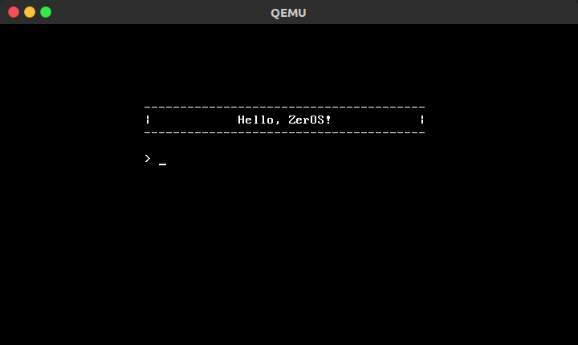

## Zeros : A baby OS from 0 to 1 for fun.



### Run

- Download [Zeros.iso](https://github.com/chiyiw/zeros/releases)

- QEMU

    ```bash
    sudo apt install qemu
    qemu-system-i386 -cdrom zeros.iso
    ```

- Oracle VirtualBox | Vmware Play

    google and make it.

### Dev

env

- Ubuntu 16.04 : Linux Ubuntu 4.15.0-64-generic #73~16.04.1-Ubuntu

tools

- nasm : NASM version 2.11.08
- gcc  : gcc (Ubuntu 4.9.4-2ubuntu1~16.04) 4.9.4
- qemu : QEMU emulator version 2.5.0 (Debian 1:2.5+dfsg-5ubuntu10.41)
- genisoimage : genisoimage 1.1.11 (Linux)

    ```bash
    sudo apt install nasm gcc qemu genisoimage
    ```

run | debug | release

-
    ```bash
    # run
    make run

    # debug
    make debug

    # release
    make iso
    ```

### Discuss

- [github issue](https://github.com/chiyiw/zeros/issues)
